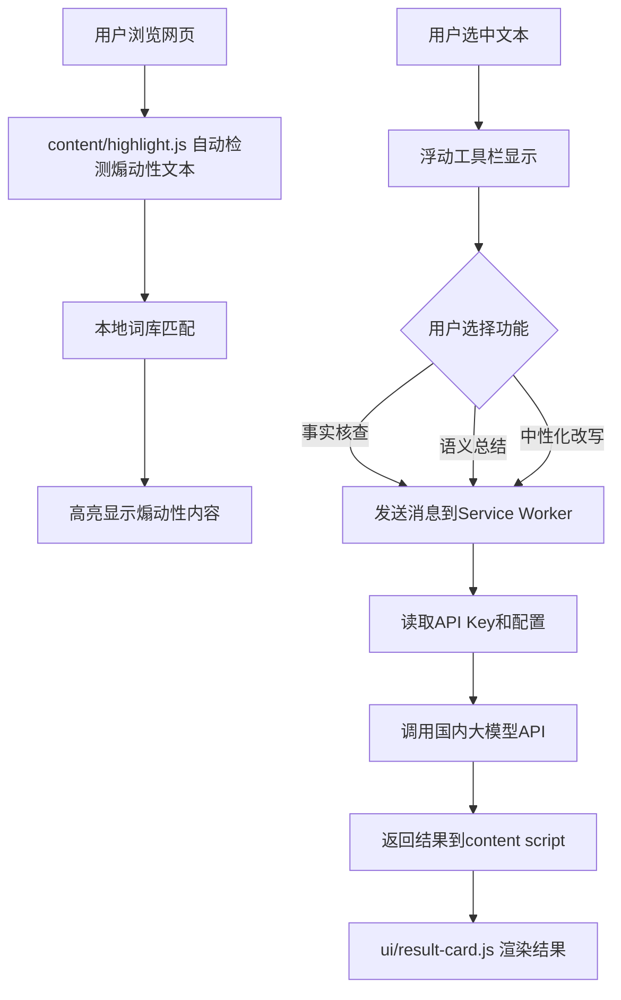

## 产品概述

将现有"煽动性语言检测插件"升级为多功能AI内容分析工具，集成本地煽动性词库检测与国内大模型API，提供四大核心功能。

## 核心功能

1. **识别并高亮煽动性语言**（本地处理）：使用本地煽动性词库检测页面文本，不使用大模型，实时高亮显示
2. **事实核查**（大模型）：用户框选文本后调用国内大模型进行事实核查，返回可信度评估与来源
3. **语义总结**（大模型）：用户框选文本后调用大模型生成内容摘要
4. **中性化改写**（大模型）：用户框选文本后调用大模型进行语气中性化、去情绪化处理

## 技术约束

- 完全舍弃原有本地BERT模型，改用国内大模型API（通义千问/文心一言/GLM）
- API Key存储在chrome.storage.local，通过background service worker调用（保护API Key）
- 使用Chrome Extension Manifest V3架构

## 技术栈选择

- **架构**: Chrome Extension Manifest V3
- **前端**: 原生JavaScript + CSS
- **存储**: chrome.storage.local（API Key、用户设置）
- **AI接口**: 国内大模型API（通义千问、文心一言、智谱GLM）

## 实现方案

### 功能1：本地煽动性词库检测

- 将 `simple_api.py` 中的 `INCITING_KEYWORDS` 提取到 `assets/sensitive_words.json`
- `content/highlight.js` 加载词库，使用Aho-Corasick或简单关键词匹配算法进行本地检测
- 检测到煽动性文本后使用 `highlightTextNode` 方法高亮显示

### 功能2-4：大模型API调用

- 用户选中文本后，浮动工具栏提供四个功能按钮
- 点击按钮发送消息到 `background/service-worker.js`
- Service Worker 从 `chrome.storage.local` 读取API Key和模型配置
- 构造对应大模型的请求格式，调用API并返回结果
- `ui/result-card.js` 渲染结果展示卡片

### 大模型API适配

- **通义千问**: `https://dashscope.aliyuncs.com/api/v1/services/aigc/text-generation/generation`
- **文心一言**: `https://aip.baidubce.com/rpc/2.0/ai_custom/v1/wenxinworkshop/chat/completions`
- **智谱GLM**: `https://open.bigmodel.cn/api/paas/v4/chat/completions`
- 统一封装适配层，根据用户选择的模型自动切换请求格式

### 数据流设计



## 实现注意事项

- **API Key安全**: 严禁在content script中直接调用大模型API，必须通过Service Worker中转
- **词库加载**: 使用fetch加载 `sensitive_words.json`，缓存到内存避免重复读取
- **文本选择监听**: 使用 `document.addEventListener('selectionchange')` 监听用户选中文本
- **浮动工具栏定位**: 根据选区位置动态计算工具栏显示位置，避免超出视口
- **错误处理**: 网络超时、API限流、Key失效等情况需友好提示用户
- **性能优化**: 大文本分段处理，避免单次请求过长导致超时

## 目录结构

```
frontend-extension/
├── manifest.json                    # [MODIFY] 扩展permissions和host_permissions
├── assets/
│   ├── sensitive_words.json         # [NEW] 本地煽动性词库
│   └── icons/                       # [EXIST] 插件图标
├── content/
│   ├── highlight.js                 # [NEW] 本地煽动性词库检测与高亮
│   ├── selection-handler.js         # [NEW] 文本选择与浮动工具栏
│   └── content-script.js            # [MODIFY] 整合入口，加载highlight和selection
├── background/
│   └── service-worker.js            # [MODIFY] 大模型API调用、配置管理
├── popup/
│   ├── popup.html                   # [MODIFY] 增加设置入口
│   ├── popup.css                    # [EXIST]
│   └── popup.js                     # [MODIFY] 增加设置页面跳转
├── options/
│   ├── options.html                 # [NEW] 设置页面（API Key配置、模型选择）
│   ├── options.css                  # [NEW]
│   └── options.js                   # [NEW]
├── ui/
│   ├── toolbar.js                   # [NEW] 浮动工具栏组件
│   └── result-card.js               # [NEW] 结果展示卡片组件
├── lib/
│   └── utils.js                     # [NEW] 工具函数（文本处理、DOM操作）
└── styles/
    └── extension.css                # [NEW] 全局样式（高亮、工具栏、卡片）
```

## 关键代码结构

### 大模型API适配器接口

```javascript
// background/service-worker.js
class LLMProvider {
  async factCheck(text) { }
  async summarize(text) { }
  async neutralize(text) { }
}

class QwenProvider extends LLMProvider { }
class WenxinProvider extends LLMProvider { }
class GLMProvider extends LLMProvider { }
```

### 本地词库检测器

```javascript
// content/highlight.js
class SensitiveWordDetector {
  constructor(wordList) { }
  detect(text) { } // 返回匹配结果数组
  highlight(node, matches) { }
}
```

## 设计风格

采用现代简洁的Material Design风格，强调功能性与可读性。界面元素使用圆角卡片设计，配色以蓝色系为主，传达专业、可信的感觉。

## 页面规划

1. **Popup弹窗页**: 插件主入口，显示功能开关、今日用量统计、设置入口
2. **Options设置页**: API Key配置、模型选择（通义千问/文心一言/GLM）、功能开关
3. **浮动工具栏**: 用户选中文本后出现的工具栏，包含四个功能按钮（事实核查、语义总结、中性化改写、取消）
4. **结果展示卡片**: 显示大模型返回的结果，支持复制、关闭操作

## 单页区块设计

### Popup弹窗页

- **顶部Header**: 插件Logo和名称，版本号
- **统计区域**: 今日检测次数、节省时间等数据卡片
- **功能开关**: 煽动性检测、事实核查、语义总结、中性化改写的开关
- **底部操作**: 设置按钮、反馈链接

### Options设置页

- **API配置区**: API Key输入框（密码显示）、模型选择下拉框、测试连接按钮
- **功能配置区**: 各功能的详细配置（如总结长度、改写风格）
- **关于区域**: 版本信息、使用说明链接

### 浮动工具栏

- **工具栏主体**: 圆角矩形，阴影效果，跟随选区位置
- **功能按钮**: 四个图标按钮（事实核查、语义总结、中性化改写、关闭），悬停显示tooltip

### 结果展示卡片

- **卡片头部**: 功能名称、关闭按钮
- **内容区域**: 结果显示（支持Markdown渲染）
- **底部操作**: 复制结果、重新生成、反馈按钮